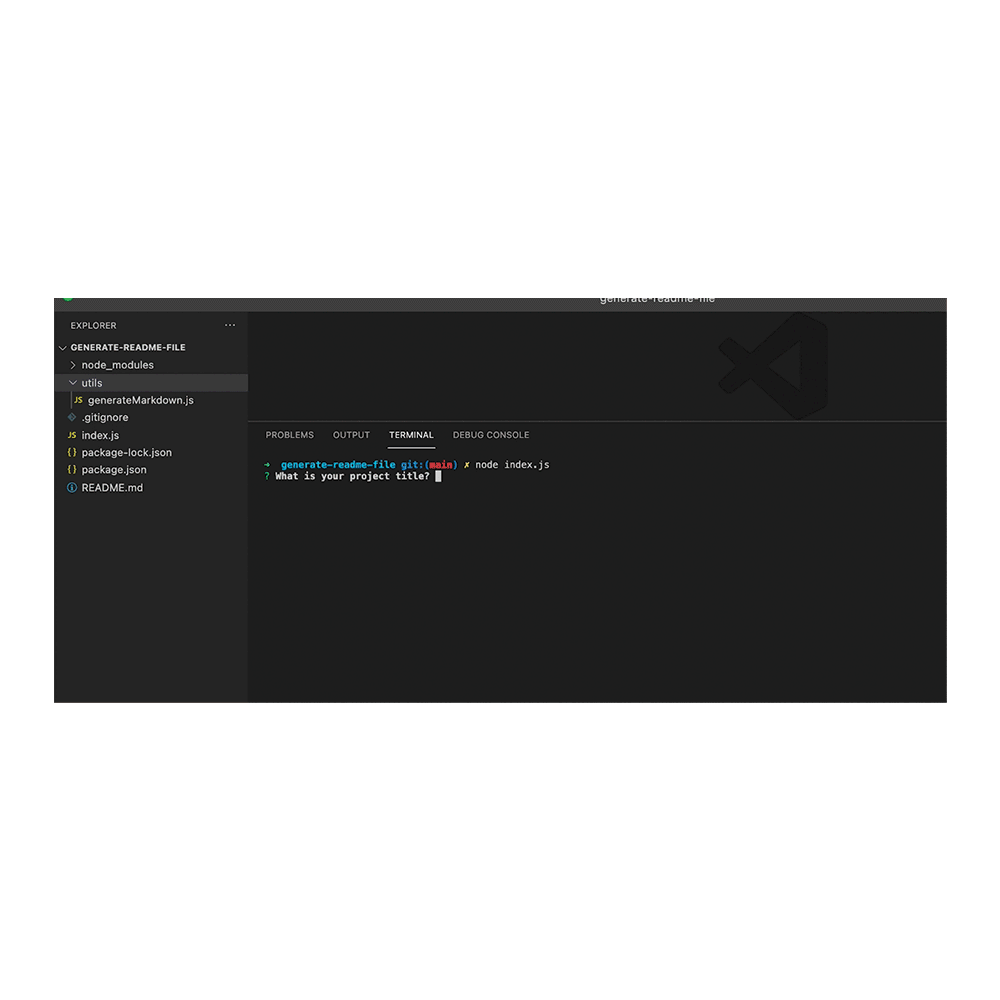

# Readme Generator

## Description
A sample README generator using the terminal command line for project information

## Table of Contents
- [Description](#description)
- [Demo](#demonstration)
- [Installation](#installation)
- [Usage](#usage)
- [Contributors](#contributors)
- [Tests](#tests)
- [Questions](#questions)
- [License](#license)

## Demontrastion
The following image demonstrates the application functionality:



## Installation
Please install node.js to run application

## Usage
npm install

## Contributors
LexMastro

## Tests
```bash
npm run test 
```

## Questions
Any questions please email mastroalexis@gmail.com

## License
This project is licensed under MIT.

